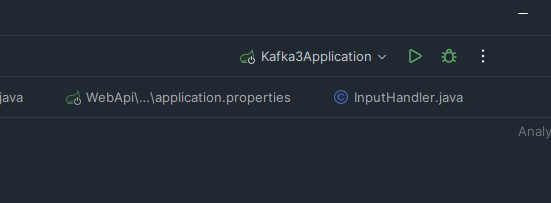

# Kafka-Springboot-webservice

## Description
This apllication was made for the reason of wanting to have a movie list for a movie night marathon were users want to binge watch a lot of movies. 
The project integrates kafka with the database MongoDb to save the data.

## Table of Contents

+ [Installation](#installation)
+ [Usage](#usage)

## Installation

*Make sure you these downloaded before you start*
+ An IDE of your choice prefurably intelliJ [Here](https://www.jetbrains.com/idea/download/#section=windows) and the latest [JDK 21](https://www.oracle.com/se/java/technologies/downloads/)
+ [Apache Kafka](https://www.apache.org/dyn/closer.cgi?path=/kafka/3.5.0/kafka_2.13-3.5.0.tgz) - Download the latest version of Apache Kafka and extract the files to a directory of your choice.
+ [MongoDB Community Server](https://www.mongodb.com/try/download/community) - Download the latest version of MongoDB and install it. Make sure to install the MongoDB Compass as well.
+ Clone this GitHub repository to your computer or download it.
+ 
## Usage
*Before starting the application make sure you have these open*
+ Open the directory where you extracted the Apache Kafka files and run the following commands in the terminal:
    + (ZooKeeper) - `.\bin\windows\zookeeper-server-start.bat .\config\zookeeper.properties`
    + (Broker) - `.\bin\windows\kafka-server-start.bat .\config\server.properties`
+ Open your MongoDb Compass and press the connect button
+ when in intellij go to WebApi module and click on Kafka3Application file and start it by clicking on the play button on the top right
 
## Credits

List your collaborators, if any, with links to their GitHub profiles.
* [member 1](https://github.com/person1)
* [member 2](https://github.com/person1)

## Dependencies
If you used any third-party assets that require attribution, list the creators with links to their primary web presence in this section.
* [junit jupiter 5](https://mvnrepository.com/artifact/org.junit.jupiter/junit-jupiter/5.7.0)

If you followed tutorials, include links to those here as well.

## License

The last section of a high-quality README file is the license. This lets other developers know what they can and cannot do with your project. If you need help choosing a license, refer to [MIT License](https://choosealicense.com/licenses/mit/).

---

🏆 The previous sections are the bare minimum, and your project will ultimately determine the content of this document. You might also want to consider adding the following sections.

## Badges

Badges aren't necessary, per se, but they demonstrate street cred. Badges let other developers know that you know what you're doing. Check out the badges hosted by [shields.io](https://shields.io/). You may not understand what they all represent now, but you will in time.

## Features

If your project has a lot of features, list them here.

## How to Contribute

If you created an application or package and would like other developers to contribute it, you can include guidelines for how to do so. The [Contributor Covenant](https://www.contributor-covenant.org/) is an industry standard, but you can always write your own if you'd prefer.

## Tests

Go the extra mile and write tests for your application. Then provide examples on how to run them here.
