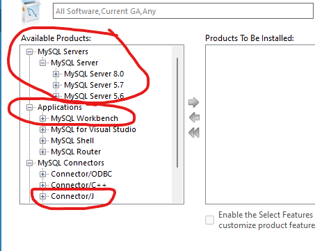
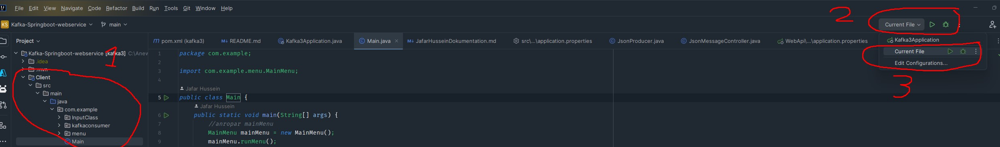

# Kafka-Springboot-webservice

## Description
This application was created to enhance the movie-watching experience during marathon movie nights. It leverages the power of Apache Kafka and MongoDB to efficiently manage movie lists. By integrating Kafka, real-time updates are ensured, and users can easily access their lists from the Kafka server's topic, making movie night planning seamless and enjoyable

## Table of Contents

+ [Installation](#installation)
+ [Usage](#usage)
+ [Dependencies](#Dependencies)

## Installation

*Make sure you these downloaded before you start*
+ An IDE of your choice prefurably intelliJ [Here](https://www.jetbrains.com/idea/download/#section=windows) and the latest [JDK 21](https://www.oracle.com/se/java/technologies/downloads/)
+ [Apache Kafka](https://www.apache.org/dyn/closer.cgi?path=/kafka/3.5.0/kafka_2.13-3.5.0.tgz) - Download the latest version of Apache Kafka and extract the files to a directory of your choice.
+ [MySQL Community Server](https://dev.mysql.com/downloads/mysql/) - Download comunity server and make sure you download the latest server and workbench, also make sure you download the connector/j as shown in the picture below
+ 
+ Clone this GitHub repository to your computer or download it.
## Usage
*Before starting the application make sure you have these open*
+ Open the directory where you extracted the Apache Kafka files and run the following commands in the terminal:
    + (ZooKeeper) - `.\bin\windows\zookeeper-server-start.bat .\config\zookeeper.properties`
    + (Broker) - `.\bin\windows\kafka-server-start.bat .\config\server.properties`
    + note that the terminals must stay open all the time until you are done with everything
+ if you are using macOs or Linux the commands are different, use this link and follow the instructions to start your server [Start kafka server and zookeper for linus or mac](https://kafka.apache.org/quickstart)

+ In the properties file [application.properties](WebApi/src/main/resources/application.properties) you should change the spring.datasource.password to your own sql password
+ Open your MongoDb Compass and press the connect button
+ when in intellij go to WebApi module and click on Kafka3Application file and start it by clicking on the play button on the top right
 

+ now go to the client module and start the main class
+ 

  ## setup
### JsonMessageController
+ This class is a Spring Boot REST controller.
+ It handles HTTP POST requests at "/api/v1/kafka/json/publish"
+ When it receives a request, it sends JSON data to a Kafka topic using a JsonProducer.

### JsonProducer
+ This class is a Kafka producer service
+ It sends messages to a Kafka topic with JSON data
+ If the message or any of its fields are null, an error message is logged, and the message is not sent
### JsonConsumer
+ This class is a Kafka consumer service
+ It listens to a Kafka topic with the specified topic name and group ID
+ When a message is received, it saves the message in a database and logs the message received
### ClientConsumer
+ This class is a service responsible to send movie data to the Web API
+ It configures a Kafka consumer with the specified properties
+ It polls the Kafka topic for records in JSON format, processes them, and returns a list of MovieInfo objects

## Dependencies
If you used any third-party assets that require attribution, list the creators with links to their primary web presence in this section.
+ [junit jupiter 5](https://mvnrepository.com/artifact/org.junit.jupiter/junit-jupiter/5.7.0)
+ [Spring Boot Starter Web 3.1.4](https://mvnrepository.com/artifact/org.springframework.boot/spring-boot-starter-web/3.1.4)
+ [Spring Kafka 3.0.11](https://mvnrepository.com/artifact/org.springframework.kafka/spring-kafka/3.0.11)
+ [Lombok 1.18.30](https://mvnrepository.com/artifact/org.projectlombok/lombok/1.18.30)
+ [Spring Boot Starter Test 3.1.4](https://mvnrepository.com/artifact/org.springframework.boot/spring-boot-starter-test/3.1.4)
+ [Spring Boot Kafka Test 3.0.11](https://mvnrepository.com/artifact/org.springframework.kafka/spring-kafka-test/3.0.11)
+ [MySQL Connector Java 8.1.0](https://mvnrepository.com/artifact/com.mysql/mysql-connector-j/8.1.0)
+ rest is in the pom files [pom file](pom.xml)

## License

The last section of a high-quality README file is the license. This lets other developers know what they can and cannot do with your project. If you need help choosing a license, refer to [MIT License](https://choosealicense.com/licenses/mit/).
